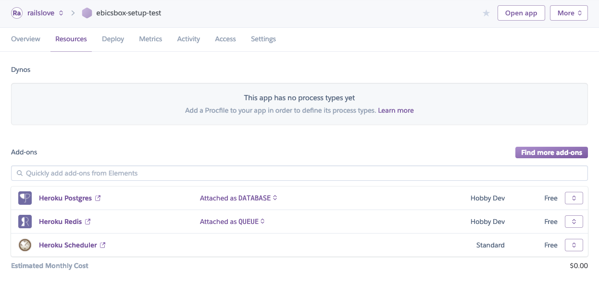

# What's heroku?

[heroku](https://heroku.com) is a Platform as a Service Provider. Instead of hosting the ebicsbox on your own infrastructure it's possible to host the ebicsbox on heroku and benefit from the ease of deployment and the flexibility of scaling as needed.

## Requirements

- [Heroku](https://heroku.com) Account
- [Heroku CLI](https://devcenter.heroku.com/articles/heroku-cli)

## Initial setup

#### Prepare your CLI

Prepare your heroku CLI by updating to beta and activating the manifest plugin:

```bash
> heroku update beta
# heroku: Updating CLI from 7.19.4 to 7.19.4-beta.2a7fcad (beta)... done
# heroku: Updating CLI... done
# Updating completions... done

> heroku plugins:install @heroku-cli/plugin-manifest
# Installing plugin manifest... installed v0.0.5

> heroku plugins:install heroku-open-dashboard
# Installing plugin heroku-open-dashboard... installed v1.0.6
```

#### Create the app

After doing so, setup the new app **from within the folder with the `heroku.yml`** using the manifest option

```bash
> heroku create DESIRED_APP_NAME --manifest --team=TEAM --region=eu
# Reading heroku.yml manifest... done
# Creating ⬢ ebicsbox... done, region is eu, stack is container
# Adding heroku-postgresql... done
# Adding heroku-redis... done
# Adding scheduler... done
```

#### Set ENV

Afterward, make sure to set the required environment variables

```bash
> heroku config:set --app DESIRED_APP_NAME PASSPHRASE=`openssl rand -base64 32`
# Setting PASSPHRASE and restarting ⬢ ebicsbox... done, v7
# PASSPHRASE: o6Hsd6BtA8o+h/BdCg04u71KbWVsBdPpShy2jWCGN80=

> heroku config:set --app DESIRED_APP_NAME APP_URL=URL_FOR_THE_APP
# Setting APP_URL and restarting ⬢ ebicsbox... done, v8
# APP_URL: https://ebicsbox.herokuapp.com/
```

#### Manage Resources

Then open the apps overview

```bash
> heroku browse:resources --app DESIRED_APP_NAME
```

and you should see something like this, where you can adjust your databse and redis plan to your desire.



Also, adjust the scheduler settings to run these every hour:

```bash
> rake enqueue:update_processing_status
> rake enqueue:fetch_account_statements
```


#### Sentry

If you'd like you could setup sentry as follows to keep track of errors and mishaps.

In any case you need to enable meta-info for your dynos:

```bash
> heroku labs:enable runtime-dyno-metadata --app DESIRED_APP_NAME
# Enabling runtime-dyno-metadata for ebicsbox... done
```

For self-hosted sentry-instances, set the required environment variable

```bash
> heroku config:set --app DESIRED_APP_NAME SENTRY_DSN=https://example.org/sentry/1337
# Setting SENTRY_DSN and restarting ⬢ ebicsbox... done, v9
# SENTRY_DSN: https://example.org/sentry/1337
```

or add the heroku plugin, which will create a Sentry account for you automatically set `SENTRY_DSN`

```bash
> heroku addons:add --app DESIRED_APP_NAME sentry
# Creating sentry on ⬢ ebicsbox... free
# Sentry has been provisioned
#
# Please visit https://docs.sentry.io/ for further instructions
# Created sentry-animate-94502 as SENTRY_DSN
```

#### Deploy to heroku

Then add the git handle and push the first iteration.

```bash
> heroku git:remote --remote heroku --app DESIRED_APP_NAME
# set git remote heroku to https://git.heroku.com/ebicsbox.git

> git push heroku master
# Enumerating objects: 5758, done.
# Counting objects: 100% (5758/5758), done.
# Delta compression using up to 4 threads
# Compressing objects: 100% (2597/2597), done.
# Writing objects: 100% (5758/5758), 2.33 MiB | 463.00 KiB/s, done.
# Total 5758 (delta 3330), reused 4953 (delta 2783)
# remote: Compressing source files... done.
# remote: Building source:
# remote: === Fetching app code
# remote:
# remote: === Building worker (dockerfiles/Dockerfile.worker)
# ...
# ...
# this might take a while
# ...
# ...
# remote: latest: digest: sha256:cf7e91af1e458d1cd45504a20185cdf421c1d44a3d55c818b40106f4ccbcb317 size: 5125
# remote:
# remote: Verifying deploy... done.
# remote: Running release command....
# remote:
# remote: migrated to:
# remote: Waiting for release.... done.
# To https://git.heroku.com/ebicsbox.git
```

Voilà, that should do the trick. Go and try reloading the page.

Also, make sure you have at least one worker dyno startet as it seems that this is not the case by default. To do so run:

```bash
> heroku ps:scale web=1 worker=1 --app DESIRED_APP_NAME
# Scaling dynos... done, now running worker at 1:Hobby, web at 1:Hobby
```
